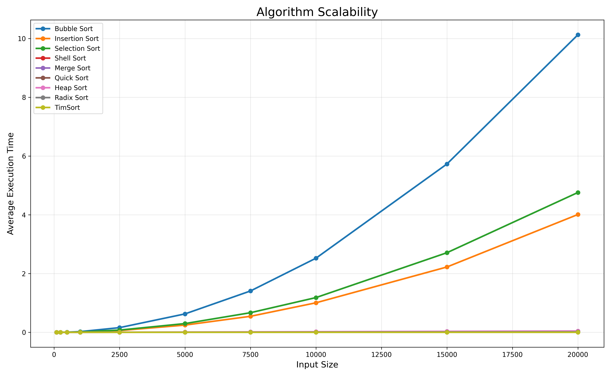
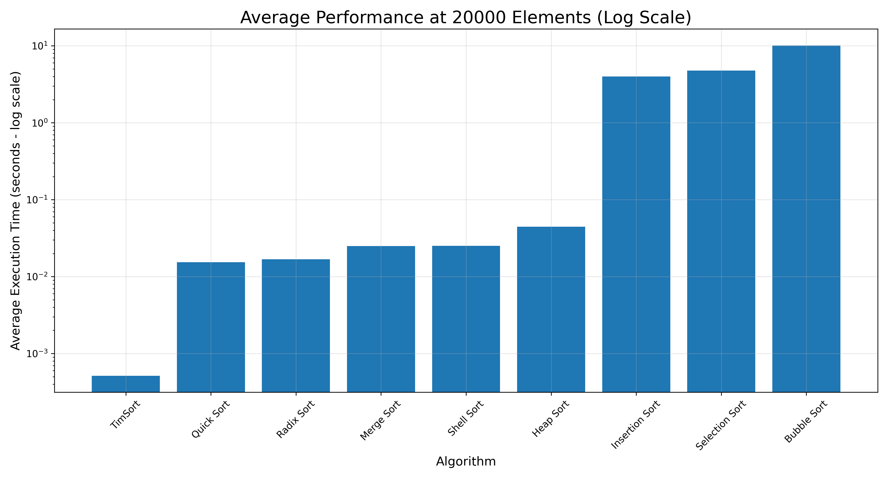
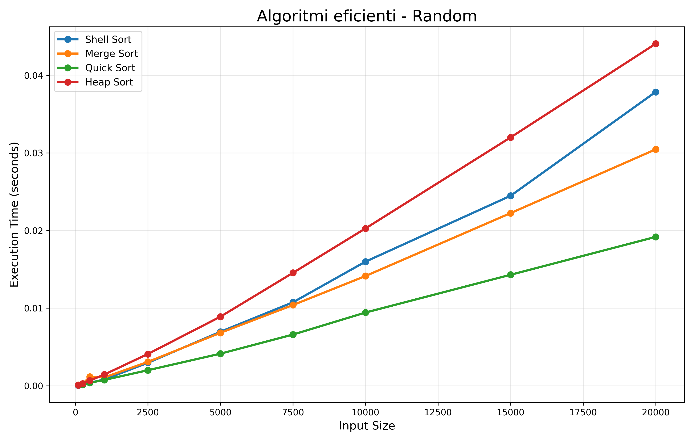
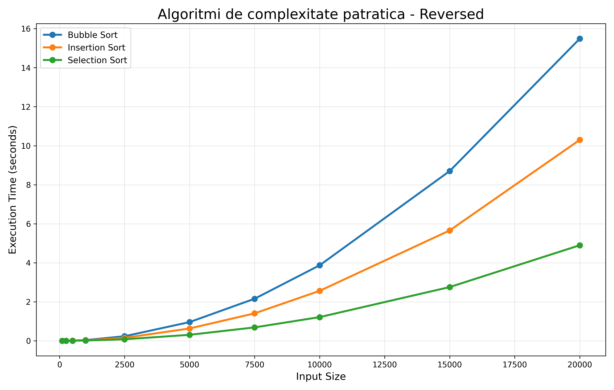

# Analiza performantelor algoritmilor de sortare

Acest proiect reprezinta un studiu experimental realizat in cadrul disciplinei Algoritmi si Structuri de Date si are ca scop compararea performantelor mai multor algoritmi de sortare utilizand implementari dezvoltate in Python.

Proiectul include:
- implementarea algoritmilor de sortare;
- generarea automata a seturilor de date;
- teste de performanta pentru diferite tipuri de input;
- generarea de grafice comparative;
- analiza scalabilitatii algoritmilor;
- interpretarea rezultatelor obtinute.

---

# Algoritmi analizati

## Algoritmi de complexitate patratica
- Bubble Sort
- Insertion Sort
- Selection Sort

## Algoritmi eficienti
- Merge Sort
- Quick Sort
- Heap Sort
- Shell Sort

## Algoritmi specializati
- Radix Sort
- TimSort

---

# Tipuri de date utilizate

Testele au fost realizate pe urmatoarele tipuri de seturi de date:
- Random
- Sorted
- Reversed
- Nearly Sorted

Dimensiunile utilizate variaza intre:
- 100
- 250
- 500
- 1000
- 2500
- 5000
- 7500
- 10000
- 15000
- 20000 elemente

---

# Exemple de rezultate

## Scalability Analysis

Graficul urmator prezinta modul in care timpul de executie creste odata cu dimensiunea datelor de intrare pentru toti algoritmii analizati.

Se poate observa diferenta majora dintre algoritmii de complexitate patratica si algoritmii eficienti de tip \(O(n \log n)\).

---

## Comparatie logaritmica a performantelor

Pentru a evidentia diferentele foarte mari dintre algoritmi, a fost utilizata o scara logaritmica.

Utilizarea scalei logaritmice permite compararea simultana a algoritmilor foarte rapizi cu cei semnificativ mai lenti.

---

## Algoritmi eficienti - Date Random

Quick Sort si Merge Sort mentin performante stabile chiar si pentru volume mari de date.

---

## Algoritmi de complexitate patratica - Date Reversed

Acest scenariu evidentiaza degradarea semnificativa a performantelor algoritmilor de complexitate \(O(n^2)\).

---

# Configuratie hardware

Testele au fost executate pe urmatoarea configuratie:

- Apple MacBook Pro
- Apple M4 Pro
- 48 GB RAM
- macOS
- Python 3.x

---

# Rezultate obtinute

Proiectul evidentiaza:
- diferentele dintre complexitatea teoretica si performanta practica;
- influenta tipului datelor asupra timpilor de executie;
- scalabilitatea algoritmilor moderni;
- impactul arhitecturii hardware asupra performantelor.
